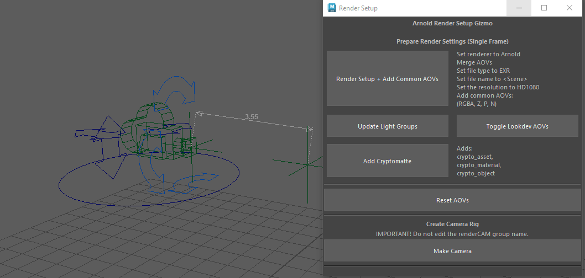

# Arnold-Render-Setup-Gizmo
Arnold Render Setup Gizmo is a Maya tool designed to speed up render setup by automating common Arnold configuration tasks. Streamlines AOV management, light group setup, and file/render settings. 

## Features:
### Render & AOV Setup
Quickly prepares a single-frame render setup and automatic creation of common compositing AOVs
- With one click, the tool automatically:
  - Sets the output file format to `.exr`
  - Sets the output file name to the scene name (`<Scene>`)
  - Enables `Merge AOVs`
  - Sets the resolution to HD 1080 (1920×1080)
  - Adds common AOVS (`RGBA`, `Z`, `N`, `P`, `crypto_asset`)

### Reset AOVs
- Removes all AOVs, including light groups, except for RGBA

### Auto add or update existing light groups
- Detects all Light Group names assigned to lights in the scene
- Automatically creates matching Light Group AOVs
- Clicking this after changes to the Light Groups (such as adding new ones or renaming) updates light groups present in the AOVs, keeping it up to date
- Works with both visible and hidden lights

### Add or remove look dev AOVs for lighting and shading breakdowns
- Quickly add or remove common look-dev passes for shading breakdowns:
- Supports `Diffuse`, `Specular`, `SSS`, and `Transmission` AOVs

### Advanced Camera Rig
A production-friendly camera rig designed for clean animation and accurate depth of field.
Features include:
- Realistic camera controls:
  - Pan
  - Boom
  - Truck
  - Dolly
  - Roll
  - Tilt
  - Global position
- Built-in locator that measures the depth-of-field automatically and connects to the camera's focal distance input 

## Possible future plans:
- Render layer presets:
  - Wireframe
