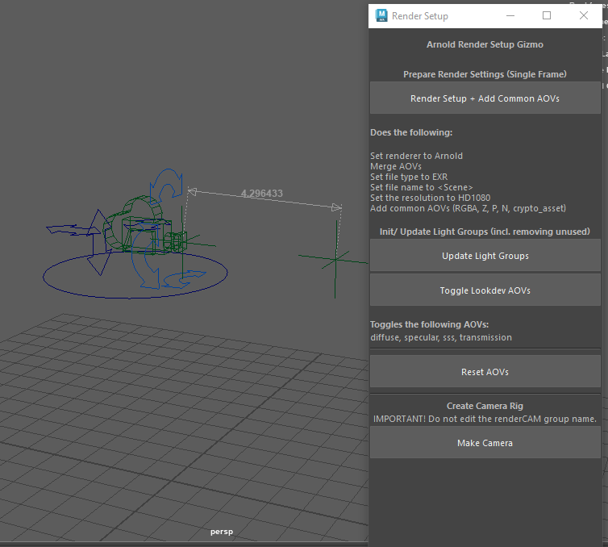

# Arnold-Render-Setup-Gizmo
Arnold Render Setup Gizmo[^1] is a Maya tool designed to speed up render setup by automating common Arnold configuration tasks. It streamlines AOV management, light group setup, and file/render settings, helping artists get to final renders faster and with fewer errors. This project was created in 2023.  

## Features:
### Render & AOV Setup
- Single-frame render setup with automatic creation of common compositing AOVs

### Reset AOVs
- Removing all AOVs (including light groups) except for RGBA

### Auto add or update existing light groups
- Works with both visible and hidden lights

### Add or remove look dev AOVs for lighting and shading breakdowns
- Supports Diffuse, Specular, SSS, Transmission AOVs

### Camera Rig
- Supports all camera movements (pan, boom, truck, dolly, roll, tilt, and overall position)
- Built-in measurement tool for depth-of-field focal distance  

### Workflow Benefits:
- Eliminate the arduous process of adding light groups with Arnold
- Better control of camera movements, cleaner animation
- Accurate DOF
- Faster overall render preparation, fewer manual setup mistakes 

## Possible future plans:
- Render layer presets:
  - Ambient Occlusion
  - Wireframe
  - Clay render with displacement/ bump (for breakdowns)

[^1]: This project was done in 2023.